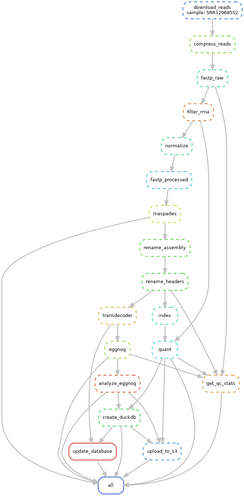

# planter: work in progress

# vision


we want to assemble and annotate transcripts

# quickstart

## requirements

* ~12gb ram
* docker & docker-compose


These two commands will do a transcriptome assembly and annotation for Mesoplasma florum:
```console
$ make image  # Build the docker image
$ docker-compose run --rm planter \
    snakemake \
        --cores 16 \
        --config samples="SRR12068547" \
        outdir="outputs" \
        s3_bucket=$S3_BUCKET  # Run the pipeline
```

Example output structure:
```console
├── SRR12068547_stats.json
├── eggnog
│   ├── SRR12068547.emapper.annotations
│   ├── SRR12068547.emapper.annotations.xlsx
│   └── plots
│       ├── cog_category_counts.csv
│       └── cog_distribution_plot.png
├── illumina
│   ├── processed                                       # Trimmed, rRNA filtered, normalized; used for assembly
│   │   ├── SRR12068547.1.fq.gz                 
│   │   ├── SRR12068547.2.fq.gz
│   │   ├── SRR12068547_fastp.html
│   │   └── SRR12068547_fastp.json
│   └── rrna_filtered                                   # Trimmed, rRNA filtered; used for quant
│       ├── SRR12068547.1.fq.gz
│       ├── SRR12068547.2.fq.gz
│       ├── SRR12068547_rRNA_filter.log
│       └── SRR12068547_rRNA_filter.stats
├── quants
│   ├── SRR12068547.quant.tsv                           # NumReads (for DESeq2) and TPM counts
=├── rnaspades
│   ├── SRR12068547_transcripts_renamed.fasta           # Headers renamed to seqhashes
│   ├── transcripts.fasta                            
└── transdecoder
    ├── SRR12068547.bed
    ├── SRR12068547.cds
    ├── SRR12068547.gff3
    ├── SRR12068547.pep                                 # Predicted proteins; used for eggNOG
```
# Workflow

## Read Processing

`workflow/rules/reads.smk`

### 1. Download the reads using `fastq-dump`

**n.b** The SRA experiment needs to be paired end. There is a command-line utility in `scripts/get_srr_metadata.py` that will get the metadata for SRA IDs:

```console
$ ./scripts/get_srr_metadata.py --help
usage: get_srr_metadata.py [-h] --srr SRR [SRR ...]

Retrieve comprehensive SRA information for one or multiple SRR
IDs

options:
  -h, --help           show this help message and exit
  --srr SRR [SRR ...]  One or more SRR IDs to look up
```

### 2. Compress the reads with `pigz`

Fast compression to `*.fastq.gz`

### 3. Preprocess the reads with `fastp`

[`fastp`](https://github.com/OpenGene/fastp) is an all-in-one read preprocessing tool. It does adapter trimming, quality filtering, and gets quality statistics.

### 4. Filter rRNA reads with `bbduk`

The rRNA sequences are obtained from the [SILVA database](https://www.arb-silva.de/download/arb-files/). We remove reads that come from rRNA.

### 5. Normalize read coverage with `bbnorm`

We even out the read coverage to make assembly more efficient.

**n.b.** This normalization is done for assembly, not for read quantification, where we would of course want to retain uneven coverage.

### 6. Get final read statistics with `fastp`

Just a sanity check.

## Assembling Genes

`workflow/rules/assembly.smk`

### 1. Assemble transcripts with `rnaSPAdes`

We opt for [`rnaSPAdes`](https://gensoft.pasteur.fr/docs/SPAdes/3.14.0/rnaspades_manual.html) over [`Trinity`](https://github.com/trinityrnaseq/trinityrnaseq) for speed and consistency. Modern reviews of RNAseq assemblers show it having comprable performance.

**n.b.** This is why we explicitly normalize the reads before `rnaSPAdes`. `Trinity` would normalize as part of the pipeline.

**n.b.** We also rename the output file from the generic `transcripts.fasta` to `{SRR_ID}_transcripts.fasta` for clarity.

### 2. Rename headers with `seqhash`

The FASTA headers from `rnaSPAdes` contain metadata information about the assembled transcript itself. For example:

`>NODE_1_length_11323_cov_82.795022_g0_i0`

Although this has useful information, we want something that:

1. Uniquely identifies the sequence
2. Is a stable identifier

To this end, we use [`seqhash`](https://keonigandall.com/posts/seqhash.html). The headers will then look like:

`>v1_DLS_f4afc4cb2e95c54f170cc1fe8bd33bb73b12b378ddccde59a53559c84a6d05bf NODE_1_length_11323_cov_82.795022_g0_i0`

i.e., `{seqhash} {original_header}`. Downstream tools utilize the seqhash to identify the sequence.

### 3. Predict ORFs with `TransDecoder`

[`TransDecoder`](https://github.com/TransDecoder/TransDecoder/wiki) will predict ORFs in the transcripts. It generates four files: a .bed file, a .gff3 file, a .cds (fasta) file, and a .pep (fasta) file. We use the .pep file for annotations.

**n.b.** According to the GitHub, `TransDecoder` is no longer maintained as of March, 2024. This may pose an issue in the future.

## Annotation

`workflow/rules/annotate.smk`

### 1. Annotate with `eggnog-mapper`

Predicted proteins (i.e. the `*.pep` file from `TransDecoder`) are functionally annotated with [`eggnog-mapper`](https://github.com/eggnogdb/eggnog-mapper) using precomputed orthologs from the [eggNOG database](http://eggnog5.embl.de/#/app/home).

`eggnog-mapper` requires pre-downloaded eggNOG databases. We have downloaded these already an EBS attached to the cloud instance located in `/mnt/data`. When running the containerized pipeline, our `docker-compose.yml` mounts this volume.

`eggnog-mapper` provides a script to download the databases. We downloaded MMSeqs2, HMMER, PFAM, and DIAMOND (for novel families) databases with:
```console
/opt/eggnog-mapper/download_eggnog_data.py -M -H -F -P --data_dir /mnt/data
```

The primary output of `eggnog-mapper` is a `{SRR_ID}.emapper.annotations` tab-delimited file and also `{SRR_ID}.emapper.annotations.xlsx` Excel file with the same contents.

There are many fields in the annotation file. A full description can be found on the [eggNOG wiki](https://github.com/eggnogdb/eggnog-mapper/wiki/eggNOG-mapper-v1#project_nameemapperannotations-file). I think there are a few columns that are of particular interest to us:

- `query_name`: The seqhash for the transcript
- `seed_ortholog`: Best predicted protein match in eggNOG
- `Description`: The functional description
- `Preferred_name`: The "standard" gene name
- `COG_category`: The COG (clusters of orthologous groups)category of the ortholog. You can find descriptions of these [here](https://www.ncbi.nlm.nih.gov/research/cog#).
- `GOs`: The gene ontology terms
- `EC`: The EC number
- `KEGG_Pathway, KEGG_Module, KEGG_Reaction, KEGG_rclass`: KEGG identifiers
- `PFAMs`: Pfam domains

### 2. Analyze the annotations with `parse_eggnog.py`

A quick Python script to count the number of hits for each COG category and visualize the results.

## Quantification

`workflow/rules/quant.smk`

### 1. Quantify expression with `salmon`

We primarily use this for QC-purposes. We will use the RNAspades transcripts and the un-normalized reads.

## Finalizing and uploading the results

`workflow/rules/finalize.smk`

### 1. QC Stats

We gather some key statistics from our various analyses and upload the results to S3.

For example, for our example Mesoplasma sample, we get:

```console
$ jq < SRR12068547_stats.json 
{
  "Number of Orthologs": 251,
  "Number of Secondary Metabolite Genes": 0,
  "Percent Mapped": 96.8,
  "Number of Reads Mapped": 6771889.0,
  "Total Reads (Before)": 16089680,
  "Total Reads (After)": 14926556,
  "Sequencing Type": "paired end (50 cycles + 50 cycles)",
  "Number of Transcripts": 3894,
  "Total Assembly Length": 1570556,
  "N50": 386,
  "ExN50": 290,
  "Average Expression (TPM)": 256.81
}
```

If we use a more interesting sample, such as SRR14292007, which is RNAseq of a lichen strain *Cladonia macilenta* that produces biruloquinone, we get:
```
$ jq < SRR14292007/SRR14292007_stats.json 
{
  "Number of Orthologs": 16763,
  "Number of Secondary Metabolite Genes": 771,
  "Percent Mapped": 97.91,
  "Number of Reads Mapped": 50725894.0,
  "Total Reads (Before)": 104107964,
  "Total Reads (After)": 103881978,
  "Sequencing Type": "paired end (100 cycles + 100 cycles)",
  "Number of Transcripts": 15757,
  "Total Assembly Length": 44849063,
  "N50": 4125,
  "ExN50": 7708,
  "Average Expression (TPM)": 63.46
}
```

We see that eggNOG identifies 16763 orthologs with 771 of them being known secondary metabolite genes! Maybe worth looking into.

### 3. Upload to S3

We then zip the output directory and upload to an S3 bucket.

# snakemake dag


## Creating and Updating the Transcriptome Database

We would like to iteratively collect transcripts we assemble into a non-redundant database we can use for downstream homology searches. For this, a utility script is provided in `scripts/ mmseqs_cluster_update.py` that takes in two inputs: the old FASTA file of transcripts and the new file we want to update it with.

```console
$ python scripts/mmseqs_cluster_update.py --help
usage: mmseqs_cluster_update.py [-h] --old OLD --new NEW [-o OUTPUT_DIR] [-t TMP_DIR]

Update MMSeqs2 clusters with new sequences.

options:
  -h, --help            show this help message and exit
  --old OLD             Path to the old representative sequences FASTA file.
  --new NEW             Path to the new sequences FASTA file to add.
  -o OUTPUT_DIR, --output_dir OUTPUT_DIR
                        Directory to store outputs.
  -t TMP_DIR, --tmp_dir TMP_DIR
                        Directory for temporary files.
```

This script wraps `mmseqs clusterupdate` and associated commands and statistics to allow easy updating of the transcriptome database.

**n.b.** We are using `mmseqs clusterupdate` to ensure the stability of cluster assignments and avoid redundant clustering.

## Homology Search

Flask app in `app/`, `python app/main.py`


# Database


# TODO

- [ x ] Write script that finalizes the output metadata
    - [ x ] Number of reads
    - [ x ] Number of rRNA reads
    - [ x ] Number of contigs
    - [ ] Number of TransDecoder predicted ORFs
    - [ ] Number of TransDecoder predicted proteins
    - [ ] Number of EggNOG Orthologs
    - [ ] Distribution of COG annotations
    - [ x ] Percentage of reads mapped to the SPAdes transcripts
- [ x ] Create database of transcripts
    - [ x ] Generate clustered representative transcripts
    - [ x ] Come up with S3 scheme
- [ x ] Create Flask app to serve the homology search

## Misc Notes

- SRR5936537: https://www.ncbi.nlm.nih.gov/sra/?term=SRR5936537
- SRR8053131: https://www.ncbi.nlm.nih.gov/sra/?term=SRR8053131
- SRR29142729: https://www.ncbi.nlm.nih.gov/sra/?term=SRR29142729
- SRR22420515: https://www.ncbi.nlm.nih.gov/sra/?term=SRR22420515

### Downloading Viridiplantae, green plants
```bash
datasets download genome taxon 33090 --include gtf,cds,protein,rna --reference
```

SourMash
```bash
find signatures -name '*.sig.gz' | xargs sourmash gather SRR2103848_trinity.Trinity.fasta.sig -o gather_results.csv
```

### Random Installation Notes

- You need to install SPAdes from source to resolve the error code -11 thing: https://github.com/ablab/spades/issues/1297


### Test Enzymes

- SRR5936537|: Genbank AUI41117.1|A0A2I6B3N5|Rhodiola rosea
- SRR8053131|Piper methysticum: Genbank QCX36371.1|A0A384E132|Piper methysticum
- SRR29142729|Gerbera hybrid cultivar: Genbank QCX36376.1|A0A4Y5QR90|Piper methysticum
- SRR22420515: Genbank BBI55602.1|BBI55602.1|

- SRR12068547 is Mesoplasma. JC got it!
